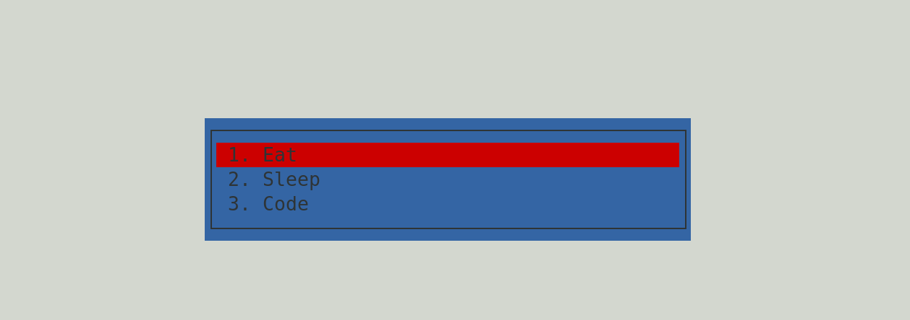

pyTodo
------

This is a simple todo-list app in python. It uses the [curses](http://docs.python.org/3/library/curses.html) module, so you will have the best chance of it running if you're on a UNIX system.



Usage
=====

```bash
python3 main.py
```

Controls
========
- **plus** - add a new item
- **up** and **down** - navigate between items
- **minus** - delete the selected item
- **q** - save and quit
- **s** - just save
